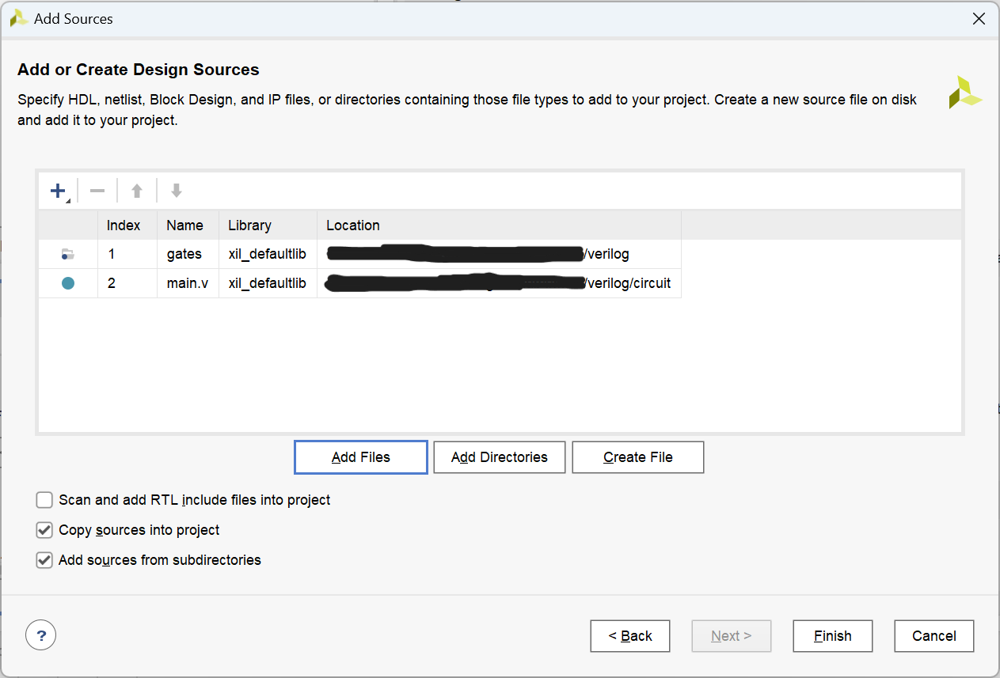
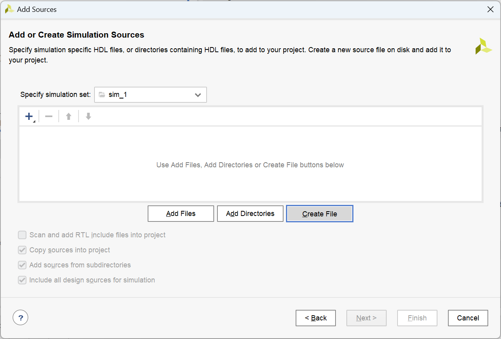
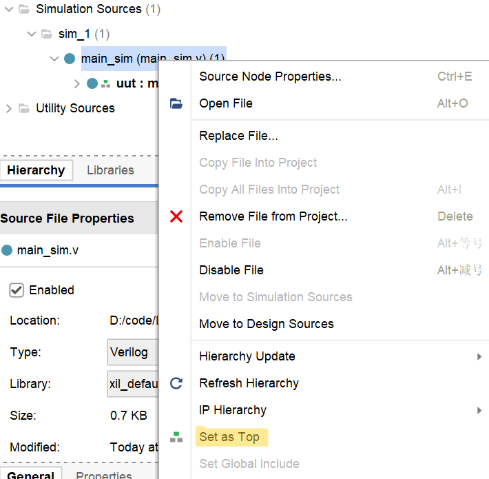
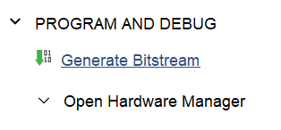
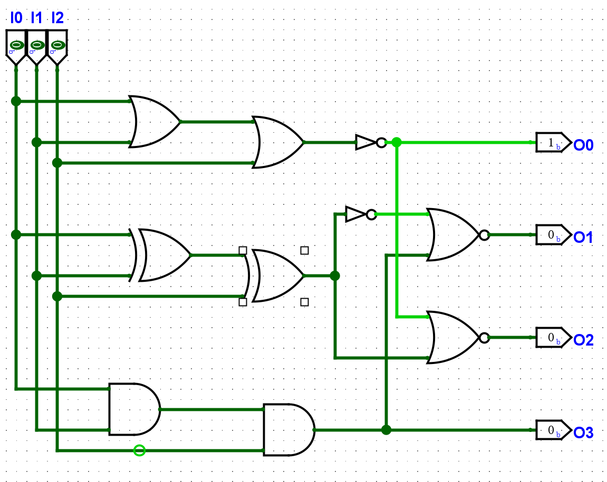

# 实验四  EDA 工具的使用

## 一    实验目的

1. 了解利用 Logisim Evolution 进行电路原理图绘制、电路仿真的方法
2. 了解利用 Vivado 进行 FPGA 工程管理的方法。

## 二    实验环境

1. EDA 工具： Logisim Evolution（依赖于 Java 16）,  Vivado
2. SWORD 开发板
3. 操作系统： Windows 10+，需要：
   - 预先配置好 Java 16或 以上，可由[此链接](https://www.oracle.com/java/technologies/downloads/)下载。下载并安装后，需将 JDK 和 JRE 的安装目录中的 `./bin` 子目录添加到 `Path` 环境变量中，且创建 `JAVA_HOME` 系统变量为 JDK 的安装目录。
   - 预先下载 Logisim Evolution。本套实验指导使用的是 3.8.0 版本。可由[此链接](https://github.com/logisim-evolution/logisim-evolution/releases/download/v3.8.0/logisim-evolution-3.8.0-all.jar)下载。 Logisim Evolution 依赖 Java 16。
   - 预先安装 Vivado。建议使用 2022.2 以上版本，可由[此链接](https://china.xilinx.com/support/download.html)下载。

## 三    实验原理

### 1. 介绍

- **LogiSim** 是一种数字逻辑电路仿真工具，用于模拟数字电路的行为和性能。 它可以用于设计和验证各种数字电路，例如计算机处理器、逻辑门电路、寄存器、时序电路等。  LogiSim 通常提供了直观的用户界面，其中包含各种数字逻辑元件的图标，例如与门、或门、异或门、触发器、计数器等。 用户可以使用这些图标来构建数字逻辑电路，然后使用仿真功能来验证电路的功能和性能。 由于支持通过鼠标拖动来直观地绘制电路，因此被广泛应用于电子工程、计算机科学、通信系统等领域相关课程教学。（摘自《计算机系统I》实验指导书）
- **FPGA**，即现场课编程逻辑门阵列，属于专用集成电路中的一种半定制电路，是可编程的逻辑列阵，能够有效的解决原有的器件门电路数较少的问题。  FPGA  的基本结构包括可编程输入输出单元，可配置逻辑块，数字时钟管理模块，嵌入式块RAM，布线资源，内嵌专用硬核，底层内嵌功能单元（摘自《计算机系统I》实验指导书）
- **Verilog** 是一种用于描述、设计电子系统（特别是数字电路）的硬件描述语言。 Verilog 能够在多种抽象级别对数字逻辑系统进行描述：既可以在晶体管、逻辑门进行描述，也可以在寄存器传输级对电路信号在寄存器之间的传输情况进行描述。除了对电路的逻辑功能进行描述， Verilog 代码还能够被用于逻辑仿真、逻辑综合，其中后者可以把寄存器传输级的 Verilog 代码转换为逻辑门级的网表，从而方便在 FPGA 上实现硬件电路。（摘自中文维基百科）
- **Vivado** 是 Xilinx 开发的一款用于硬件描述语言设计的合成和分析的软件套件，具有用于片上系统开发和高级综合的附加功能。（摘自中文维基百科）

### 2. Logisim 的基本操作

#### (1) 电路原理图的绘制

- 按 Ctrl+5 或鼠标点击窗口上方的对应按钮，可添加输入端口入电路原理图中：


- 按 Ctrl+7、 8 、9、0 或用鼠标点击对应按钮，可以分别向电路原理图中添加非门、与门、或门、异或门：


- 按 Ctrl+6 或用鼠标点击对应按钮，可以向电路原理图中添加输出端口：


- 按 Ctrl+3 或用鼠标点击对应按钮，可以在电路原理图中画线：


- 画好电路原理图之后，按 Ctrl+1，即可通过点击输入端口来改变输入端口的输入值，从而可以通过遍历所有输入值来检查电路功能是否正常。其中，深绿色表示低电平，亮绿色表示高电平。


- 按 Ctrl+2 或鼠标点击对应图标后，双击输入输出端口，即可为其命名。只有将输入、输出端口命名，方可将其正常地转为Verilog。


#### (2) 将电路图导出为Verilog

Vivado 无法读取 Logisim 的工程文件或原理图文件，需要通过将 Logisim 电路图转化为 Verilog 之后，方可在 Vivado 中进行电路实现。通过 Logisim 电路原理图导出 Verilog 的方法如下：

- 首先，点击上方状态栏的 `FPGA -> Synthesize & Download`


- 在弹出的窗口中，选择目标板为 `FPGA4U`


- 点击 `Settings` 按钮。


- 将弹出窗口中 `FPGA Commander Settings ` 选项下的 `Hardware discription language used for FPGA commander ` 选项更改为 `Verilog`，将 `Workspace location` 设置成你想要的文件夹路径，随后可关闭弹出窗口。


- 点击 `Execute`，随后点击弹出窗口中的 `Done` 即可完成。


- 此时即可在之前所设置的` Workspace location` 目录下  `./verilog`  子目录中看到生成的 Verilog 文件。
- 将生成的 Verilog 文件导入 Vivado 时，我们只需要导入 `./gates` 和 `./circuit` 子目录的文件。

### 3. Vivado 基本操作

#### (1) 创建 Vivado 工程

- 启动 Vivado 之后，选择顶部快捷栏中的 `File -> Project -> New`：


- 按照提示添加工程名称及路径：


- 在工程类型下选择图中选项：


- 选择`xc7k160tffg676-2L`开发板：


- 点击`Finish`即可完成工程创建：


#### (2) 添加工程源文件

- 在页面左侧 `Flow Navigator` 中的 `Project Manager` 中选择 `Add Sources`，即可在工程中添加或创建文件。


- 随后在弹出窗口中选择添加或创建的源文件的类型。其中， `Add or create design sources`  表示添加设计源文件， `Add or create simulation sources` 表示添加仿真激励文件， `Add or create constraints` 表示添加引脚约束文件。仿真激励文件和引脚约束文件会在后文介绍，此处以添加设计源文件为例。


- 点击 `Next` 进入下一步。此处， `Add Files` 指添加特定源文件进入当前工程， `Add Directories` 指添加特定目录下的所有源文件进入工程， `Create File` 指在工程中新建文件。


- 指定了所需要的源文件后，可以选择是否勾选 `Copy sources into project` 和 `Add sources from subdirectories` 选项。其中， `Copy sources into project` 选项勾选后可以将上一步指定的源文件复制一份到当前工程目录中，以方便工程管理和文件管理； `Add sources from subdirectories` 选项勾选后可以将选中的目录的子目录中的源文件添加到工程中。



- 选择完成后，点击 `Finish`，即可完成添加源文件操作。

#### (3) 创建工程源文件

- 在页面左侧的 `Flow Navigator -> Project Manager` 中选择 `Add Sources`，随后选择要创建的文件类型（此处以仿真激励文件为例），并点击下一步：



- 选择 `Create File`，随后选择文件类型、输入文件名称：


- 创建完成后，点击 `Finish`。随后，输入刚刚创建的文件的模块端口并点击 `OK`（也可以不输入直接按提示操作到底）：


- 完成后，使用 Vivado 或其他编辑器编辑该文件即可。

#### (4) 运行行为仿真

- 在窗口左上方的 `Sources` 中选择将要运行的仿真激励文件，点击右键后选择 `Set as Top`：



- 完成后，在窗口左侧的 `Flow Navigator -> Simulation` 中左键点击 `Run Simulation`，随后选择 `Run Behavioral Simulation`：


#### (5) 上板

- 将需要上板的模块设置为 Top 模块之后，在窗口左侧的 `Flow Navigator -> Synthesis` 中左键点击 `Run Synthesis`，运行综合。


- 综合完成后，在窗口左侧的 `Flow Navigator -> Implementation` 中左键点击 `Run Implementation`，运行电路实现。


- 实现完成后，在窗口左侧的 `Flow Navigator -> Program and Debug` 中左键点击 `Generate Bitstream`，以生成比特流文件。



- 比特流文件生成完成后，在窗口左侧的 `Flow Navigator -> Program and Debug` 中左键点击 `Open Hardware Manager`，并将 Sword 开发板与电脑连接。


- 打开 `Hardware Manager` 后，点击窗口左上方 `Open Target -> Auto Connect`，以将 Vivado 连接到开发板。
- 成功后，点击 `Program Device`，将生成的比特流文件加载到开发板上。
- 完成后，即可上板验证模块实现是否正确。


## 四    实验步骤

### 1. 使用 Logisim 实现给定电路并进行仿真

按照上一部分所述方法，使用 Logisim 绘制如下电路图，并生成对应的 Verilog 代码：




绘制原理图时需注意端口命名。

### 2. 使用 Vivado 对给定电路进行行为仿真

按照上一部分所述方法创建仿真激励文件，并且将如下仿真激励代码添加到该文件中，随后运行行为仿真，观察波形图：

```verilog
module main_sim();
    
    reg [2:0] i;
    wire o0, o1, o2, o3;
    
    // 将此处的 "main" 更改为 Logisim 生成的 Verilog 代码中上图电路对应的模块名称
    main uut(.I0(i[0]), .I1(i[1]), .I2(i[2]), .O0(o0), .O1(o1), .O2(o2), .O3(o3));
    
    initial 
        for (i = 3'b0; 1; i = i+1) #100;
    
endmodule
```

### 3. 使用Vivado对给定电路进行上板验证

按照上一部分所述方法创建引脚约束文件，并且将如下引脚约束添加到该文件中，随后将该模块上板。

```
# Map input ports
set_property IOSTANDARD LVCMOS15    [get_ports I0]
set_property PACKAGE_PIN AA10       [get_ports I0]
set_property IOSTANDARD LVCMOS15    [get_ports I1]
set_property PACKAGE_PIN AB10       [get_ports I1]
set_property IOSTANDARD LVCMOS15    [get_ports I2]
set_property PACKAGE_PIN AA13       [get_ports I2]
# Map output ports
set_property IOSTANDARD LVCMOS33    [get_ports O0]
set_property PACKAGE_PIN Y22        [get_ports O0]
set_property IOSTANDARD LVCMOS33    [get_ports O1]
set_property PACKAGE_PIN Y23        [get_ports O1]
set_property IOSTANDARD LVCMOS33    [get_ports O2]
set_property PACKAGE_PIN AA23       [get_ports O2]
set_property IOSTANDARD LVCMOS33    [get_ports O3]
set_property PACKAGE_PIN Y25        [get_ports O3]
```

拨动开关中最右侧三个，观察 Arduino 子板上的 LED 灯，观察电路功能。

## 五    思考题

1. 描述电路的功能，并尝试将电路原理图中的两个二输入的与门改成一个三输入的与门。
2. 尝试简要描述实验所用的仿真激励代码和引脚约束文件中各语句的含义。
