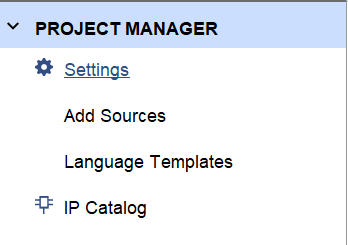
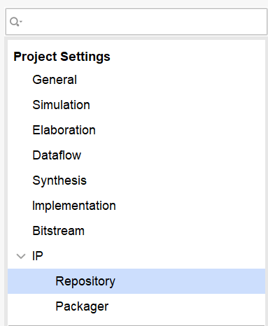
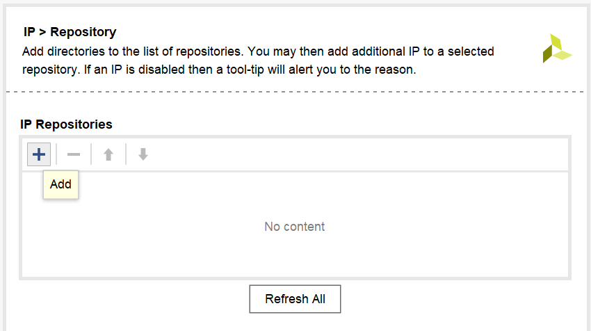
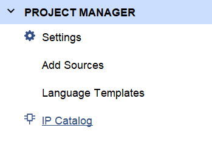
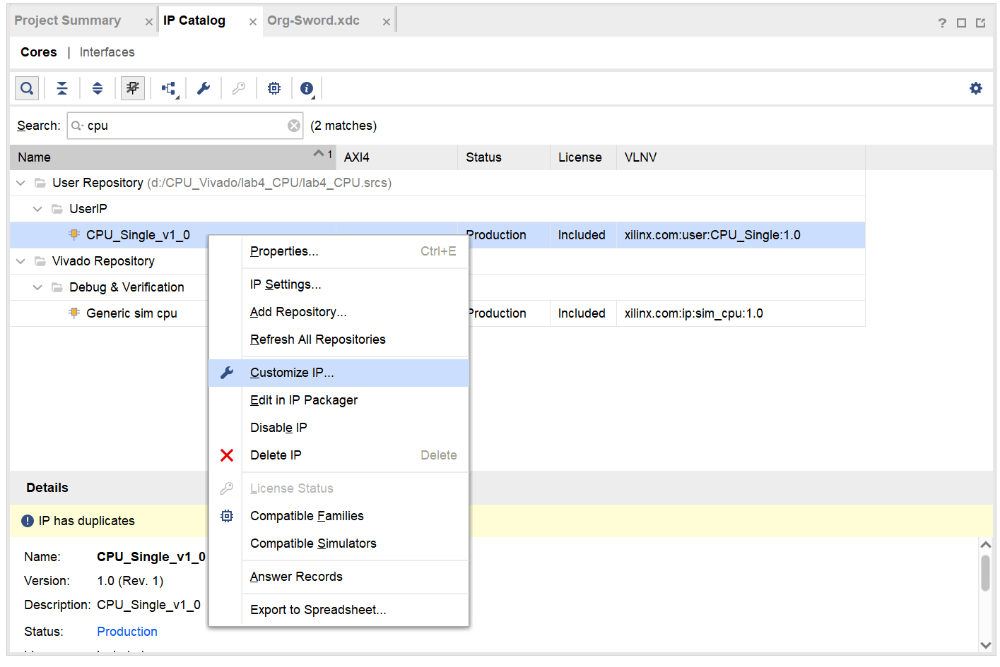

# 实验十一 时序电路设计

## 一  实验目的

1. 熟悉使用状态图、状态表、状态转移方程等进行时序电路设计的过程

## 二  实验环境

1. EDA 工具： Logisim Evolution、Vivado
2. SWORD 开发板
3. 操作系统： Windows 10+

## 三  实验原理

### 1. Vivado IP 核的使用

IP核（Intellectual Property core）是指在数字系统中可以重复使用的可设计和定制的硬件模块或设计单元。IP核可以包括处理器核心、通信接口、存储控制器、数字信号处理模块等。IP核能够帮助设计者加快设计过程、降低成本并提高设计的可重用性。使用IP核可以在设计中实现模块化的方法，这意味着设计人员可以专注于整体系统的功能，而不需要重复开发已经存在的模块。

在 Vivado 中，IP 核的格式为 `xci`。

在 Vivado 中，若需要在工程中引用已有的 IP 核，需要进行以下操作：

- 在 `Project Manager` 中，点击 `Settings`：

- 点击弹出窗口左侧的 `IP -> Repository`：

- 点击窗口右侧的 `+` 按钮，将 IP 核所在的文件夹添加到 `IP Repositories` 中：

- 在 `Project Manager` 中，点击 `IP Catalog`：

- 在随后出现的 `IP Catalog` 页面中，搜索所需要的 IP 核。找到所需要的 IP 核之后，右键点击该 IP 核并选择 `Customize IP`：

- 随后，按提示操作即可将 IP 核添加到工程中。添加 IP 核后，即可用和调用模块相同的方式在其他模块中调用 IP 核。

## 四  实验步骤

1. 使用 [top.v](top11.v) 和 [shift.v](shift.v)，以及实验七 `DisplayNum` 模块构建工程。
2. 实现 DFA 模块，其功能要求如下：
      1. DFA 为一时序电路，有两个输入和一个输出。其中，`_input` 为输入数据，每次 `has_input` 为正边沿时读取一位 `_input` 数据；`rst` 为重置信号，每次 `rst` 为正边沿时，忽略之前所读取的 `_input` 信号的所有数据，并且讲整个时序电路的状态置为初始状态，每次 `_input` 的输入数据达到十六位时，`rst` 自动置 1。
      2. 输出信号用于表示上一次重置状态后所读入的 `_input` 信号的值的序列表示的二进制数是否能够被 3 整除。如：若上一次重置之前所读入的 `_input` 序列为 `11010`，则其表示的二进制数为 26，不可被 3 整除，则输出信号应当为 0。
      3. 要求以使用状态图、状态表来构建状态转移方程和输出方程的方式实现该模块。验收时检查该模块代码。（可以使用读入序列对应二进制数除以三的余数来构建状态）

## 五  实验提交

1. 包含本实验所使用的所有 Logisim 电路图文件、Verilog 源文件、仿真激励文件和引脚约束文件的 zip 压缩包
2. 一份 PDF 格式的实验报告（无需封面），内容包含：
      - 时序电路设计过程，包含状态图、状态表、状态转移方程、输出方程及其卡诺图优化
      - 上板验证结果以及分析
      - 思考题，包含：
          1. 借助 verilog 宏定义，使用行为描述的方法实现 DFA 模块。

