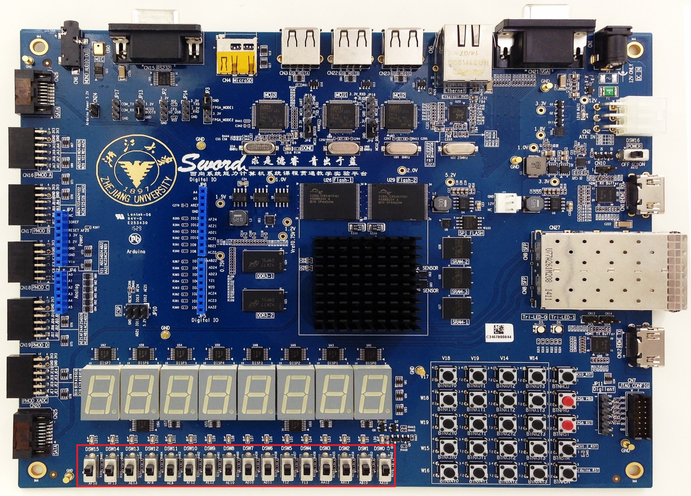
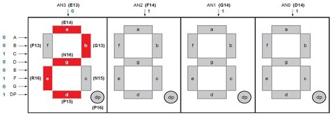
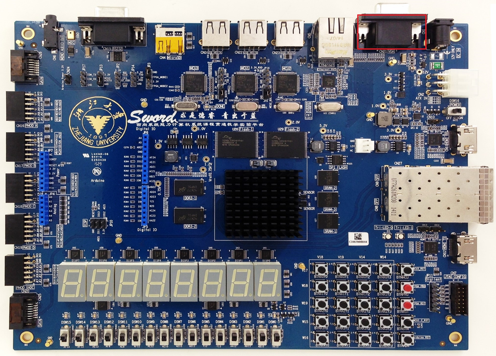

# Sword 接口说明

## 开关交互

Sword 主板上开关共有 16 个，位置如下图所示，每个开关的引脚为开关下侧的编号，如最右侧的开关的引脚为 AA10。



其引脚约束代码如右：[SW.xdc](img/sword/SW.xdc)

当开关闭合时，对应引脚的输入为 1，反之为 0。

## 子板 LED 交互

Arduino 子板上 LED 共有十六个，位置如下图所示，每个 LED 的引脚为 LED 上方的编号，如最左侧的子板 LED 的引脚为 W23。


其引脚约束代码如右：[LED.xdc](img/sword/LED.xdc)

当对应引脚输出为 1 时，LED 亮，否则 LED 灭。

## 按钮交互

Sword 主板上按钮共有 20 个，位置如下图所示。每个按钮对应其左方和上方两个引脚编号，其中左侧的表示按钮的行，右侧的表示按钮的列。


其引脚约束代码如右：[BTN.xdc](img/sword/BTN.xdc)

当某个按钮按下时，其对应行和列引脚的输入为 0，否则各引脚的输出为 1。

在使用按钮交互时，需要为按钮添加防抖动模块，即当按钮对应引脚的值在一段时间之内保持在 0 后，方认为按钮被按下。其模块接口可定义如下：

```verilog
module anti_jitter(
	input clk,
    input btn,
    output btn_ok
);
```

## 子板七段数码管交互

Arduino 子板上有七段数码管四位，位置如下图所示。在子板上标注了其各个引脚。


其引脚约束代码如右：[SEG.xdc](SEG_AN.xdc)

其中，SEG 和 AN 接口的作用如下图。



SEG 用于表示七段数码管显示的图案，0 代表对应位置的管亮，1 代表对应位置的管不亮。

当某一位 AN 为 0 时，该位显示 SEG 所表示的图案，否则该位不显示。

## VGA 交互

Sword 主板上有一个 VGA 接口，位置如下图所示。



其引脚约束代码如右：[VGA.xdc](VGA.xdc)

具体使用方式见实验十文档。

## PS/2 交互

Sword 主板上有 PS/2 接口，位置如下图所示。


其引脚约束代码如右：[PS2.xdc](img/sword/PS2.xdc)

PS/2 协议每次传输时，使用十一位信号传递一个字节的数据，先后为：1 位的起始位（始终为 0）、8 位的数据位、1 位的校验位以及 1 位的终止位（始终为 1），如下图：


由图，可得 PS2 模块通过在 PS2_clk 信号的下降沿时采集 PS2_data 信号的值即可得到 PS2 接口传入的数据。

每次键盘按下时，会传入一个通码（Make），包含 1~2 字节；每次键盘松开时，会传入一个断码（Break），包含 2~3 字节。

常用的通码键盘对照表如下图所示：


当某一按键的通码长 1 字节，为 `0xYY` 时，其断码长 2 字节，为 `0xF0 ` `0xYY`；当某一按键的通码长 2 字节，为 `0xE0` `0xYY` 时，其断码长 3 字节，为 `0xE0` `0xF0` `0xYY`。
